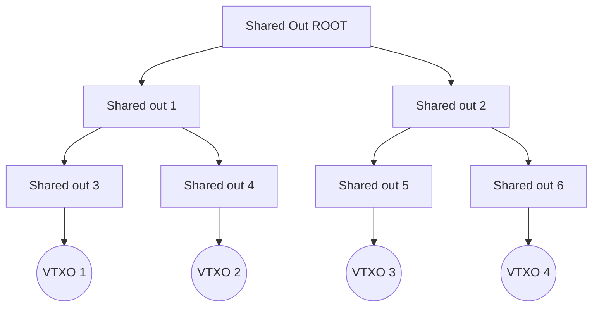

# Ark Taproot Scripts

## Script tree

Ark virtual transaction outputs (VTXO) are created by a shared output. This output is enforcing the value to be splitted into a binary tree of other taproot scripts.



_Each node of the diagram is a taproot script._

### Shared output script

A shared output is a bitcoin transaction output locked by a taproot script with 2 tapscript closures:

* [Unroll](./unroll.hack) and [Boarding](./boarding.hack) scripts use [Elements introspections opcodes](https://github.com/ElementsProject/elements/blob/master/doc/tapscript_opcodes.md) to force the spending transaction format. The tx creates the next level of the script tree on-chain. Splitting the value into 2 outputs with the children taproot scripts.
* [Sweep](./sweep.hack) lets the Ark Service Provider to spend the whole shared output after a timeout (CSV).

### VTXO script

A VTXO taproot script is the last level of the script tree. It should appear on-chain only if the VTXO owner decided to unilaterally exit the Ark. It has 2 tapscript closures:

* [Redeem](./redeem.hack) lets to spend the VTXO onchain after a CSV delay. the delay prevents the ASP to lost a VTXO spent off-chain.
* [Forfeit](./forfeit.hack) expects both parties (owner and ASP) to sign the spending transaction. It is used to spend the VTXO **off-chain**.

### Miniscript

The scripts are written using miniscript syntax. You can analyse them using the [Elements Miniscript compiler](https://github.com/louisinger/miniscript-compiler).

install the miniscript-compiler:

```bash
cargo install miniscript-compiler
```

Compile miniscript examples:

```bash
make unroll 
make onboarding
make vtxo
```
